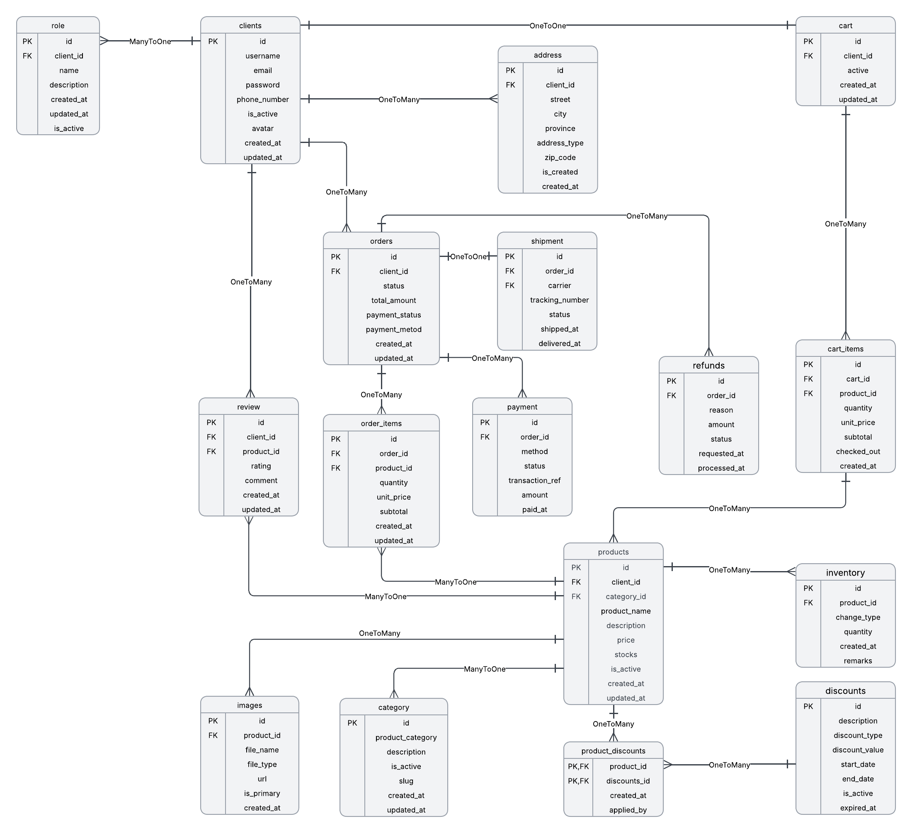

# Database Design

← [Back to README](../../README.md)

## Request flow

1. The React frontend issues an HTTP request to `/api/v1/**`.
2. A REST controller validates the request body (`@Valid`) and delegates to the matching service interface (`IClientService`, `IProductService`, `ICartService`, `IOrderService`, `IPaymentService`, `IRefundService`, `IReviewService`, `IDiscountService`, `IImageService`).
3. Services apply business rules and use per-domain DTO mapper classes to translate between JPA entities and Request/Response DTOs.
4. Repositories (Spring Data JPA interfaces, e.g. `IProductRepository`) persist to MySQL; the schema is auto-created/updated by Hibernate on startup (`ddl-auto=update`).
5. Bean-validation failures are caught by `ValidationExceptionHandler` and returned as a field-name → message map with HTTP 400.

## Entity-relationship diagram

The schema centers on `client` and `product`, with `cart`/`cart_items` supporting the pre-checkout shopping flow and `orders`/`order_items`/`payment`/`shipment`/`refunds` supporting the post-checkout flow. `category`, `images`, `inventory`, and `product_discounts` all hang off `product` to describe how it's presented, tracked, and priced.

*Figure — Entity-relationship diagram*

## Table-by-table reference

| Table | Purpose | Key relationships |
|---|---|---|
| `client` | A customer/seller account | 1:1 cart; 1:many address, orders, review, product (as seller), role |
| `role` | A role label (ADMIN/USER/SELLER) attached to a client | many:1 client |
| `address` | A shipping/billing address for a client | many:1 client |
| `cart` | A client's single active shopping cart | 1:1 client; 1:many cart_items |
| `cart_items` | A product line item inside a cart | many:1 cart; many:1 product |
| `product` | A catalog item with price, stock, and an owning seller | many:1 client (seller); 1:many cart_items, category, images, inventory, review, order_items, product_discounts |
| `category` | A category label attached to a product | many:1 product |
| `images` | A product photo, with an `is_primary` flag | many:1 product |
| `inventory` | A stock-change ledger entry for a product | many:1 product |
| `review` | A client's rating/comment on a product | many:1 product; many:1 client |
| `discounts` | A discount campaign definition | 1:many product_discounts |
| `product_discounts` | Join table linking a product to a discount | many:1 product; many:1 discounts |
| `orders` | A client's order, with payment status/method | many:1 client; 1:many order_items, payment, refunds; 1:1 shipment |
| `order_items` | A product line item inside an order | many:1 orders; many:1 product |
| `payment` | A payment attempt/record against an order | many:1 orders |
| `shipment` | Tracking/status info for an order's delivery | 1:1 orders |
| `refunds` | A refund request against an order | many:1 orders |

## Notable design characteristics

- Primary keys are `IDENTITY` (auto-increment) BIGINTs (`Role` uses a primitive `long`) across every table.
- `client.username` and `client.email` are declared unique; most other uniqueness/validation is left to the DTO layer's Jakarta Bean Validation annotations rather than the schema.
- Schema evolution is automatic: `spring.jpa.hibernate.ddl-auto=update` lets Hibernate alter tables to match the entity model on every startup — convenient in development, but risky for a production database since Hibernate's auto-migrations can silently diverge from a team's intended schema history.
- `category` currently has a `ManyToOne` relationship *to* `product` (i.e. `category.product_id` is the foreign key) rather than the more conventional direction (`product.category_id`). This means a category row belongs to one product, so categories are effectively per-product tags rather than a shared, reusable taxonomy. Worth revisiting if multiple products need to share the same category.
- `Client.orders`, `Client.product`, and several other collections are one-directional `mappedBy` associations without a matching `@JoinColumn` owner check visible in the DTO layer, so referential integrity for those edges relies on the owning side (e.g. `Product.client`, `Orders.client`) being set correctly by the service layer.
